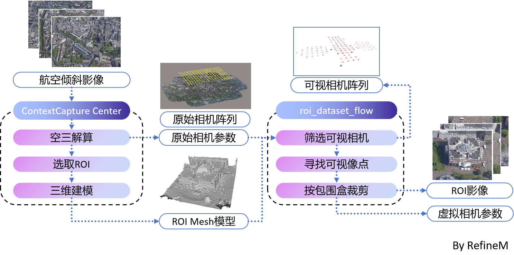
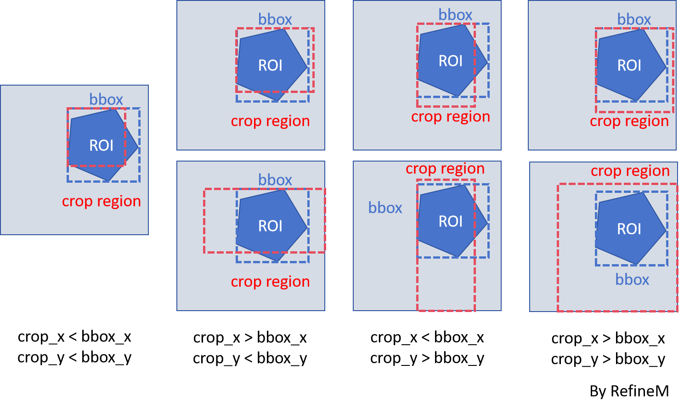

中文 | [EN](readme_EN.md)
# roi_dataset_flow
## 目标
从大型航空倾斜摄影数据集中，选择感兴趣区域 (ROI)，通过可见性筛选和按包围盒裁剪，生成新的数据集和虚拟相机参数，以便于区域性的建筑物建模。

### 可见性筛选  
* 通过比较`相机朝向c_o`和`相机中心c同兴趣区世界点p的连线c_p`之间的角度$\beta$和相机视场角$fov$的大小，来确定兴趣区的世界点是否在图像中可见。
  
  $$
     \beta = \frac{c\_p* c\_o}{||c\_p||* ||c\_o||}
  $$
  $$
     fov = arctan\frac{sensor\_size}{2focal}
  $$
  $$
     if \beta < fov/2 => visiable
  $$
* 如果感兴趣区域世界点在图像中的可见比例超过预设的阈值，则认为该图像是我们需要的，就将其筛选出来。
### 基于bbox的裁剪  
* 在经过可见性筛选后，为了专注于ROI，减少其他无关部分的干扰，基于像点-世界点之间的关系，通过相机的外部（w2c）和内部（c2p）参数，计算可见部分的边界框，并根据边界框裁剪图像（采用一些策略确保裁剪后的图像具有相同的尺寸）。


### 生成相机参数文件 (.json)

```
{
  "camera_mode": ,
  "camera_orientation": ,
  "aabb_scale": ,
  "aabb_range":,
  "sphere_center":，
  "sphere_radius":，
  "frames": [
  {
    "file_path": ,
    "intrinsic_matrix": ,
    "transform_matrix": ,
    "w": ,
    "h": 
  }, 
  ...
 }
```

## 准备
* 下载大型航空倾斜摄影数据集。
  示例：EuroSDR Benchmark for Multi-Platform Photogrammetry published by ISPRS。
  [链接](https://www2.isprs.org/commissions/comm2/icwg-2-1a/benchmark_main/)
* 在Context Capture Master中创建新项目，加载数据集并执行空三解算（如果数据质量很好，可以跳过刺点）。
* 导出相机参数文件（AT.xml）和去畸变的图像。
* 创建 reconstruction项目，选择感兴趣区域，生成mesh文件（Model.obj）和元数据文件（metadata.xml）。

## 数据组织
* 创建一个`dataset`文件夹，并按照如下格式组织：

```
dataset
|_ dataset_01
   |_ images        // 初始是空的文件夹
   |_ images_crop   // 初始是空的文件夹
   |_ AT.xml
   |_ metadata.xml
   |_ Model.obj
```

## 代码结构
```
reader
|_ camera_reader.py // 读取相机参数（AT.xml）
|_ obj_reader.py    // 读取ROI网格（Model.obj）
scripts
|_ tools.py  // 一些函数
|_ scene_visualizer.py  // 场景可视化
run.py  
```

## 参数设置
在`run.py`中设置：
#### 数据集相关
* 数据集路径 `dataset_dir`
* 数据集是否由单相机拍摄 `if_single_camera`
#### 输出影像相关
* 是否按照包围盒裁剪图像 `if_mask_crop`。如果是则输出裁剪后的影像，否则输出包含ROI的原始影像。
* 指定裁剪后统一的图像尺寸 `tar_size_w` `tar_size_h`。
#### 虚拟相机参数相关
* 是否对场景进行标准化 `if_standardization`。如果是，则会对整个场景进行平移和缩放：将坐标原点移动到mesh的几何中心；将整个场景缩放到一个目标球体之内。
* 目标球体半径 `tar_radius`。

其他输入和输出文件路径无需更改。一旦设置，运行`run.py`。

## 注意事项
* 在导出空三解算后的相机参数时，注意选择坐标轴朝向为`opencv`格式（即`xyz-RDF`）。
* 在空三解算后导出的相机参数文件中，旋转矩阵是w2c矩阵，相机中心坐标是相机在世界坐标系中的坐标。
* 对影像的缩放和裁剪操作，会改变相机的内参：
  

## 测试

* 数据集：ISPRS Penta-Cam-Centre(8bit)
* 经CC三维重建导出的兴趣区mesh： 
* 筛选出包含感兴趣区域的影像，以下是一张影像示例（8176 * 6132）： 
* 依据包围盒，将该影像中的ROI裁剪出来，输出新的影像（1200 * 1000）： 
* 同时获取新图像的相机参数：

```
"file_path": "images/001_009_145000282.jpg",
"intrinsic_matrix": [
[
    13658.7021484375,
    0.0,
    -2580.524169921875
],
[
    0.0,
    13658.7021484375,
    323.05224609375
],
[
    0.0,
    0.0,
    1.0
]
],
"transform_matrix": [
[
    0.9999997615814209,
    0.00018038207781501114,
    -0.0006661160150542855,
    -3.903818368911743
],
[
    0.0006009129574522376,
    -0.7022261023521423,
    0.7119537591934204,
    -11.74245548248291
],
[
    -0.0003393403603695333,
    -0.7119539976119995,
    -0.7022260427474976,
    11.748698234558105
],
[
    0.0,
    0.0,
    0.0,
    1.0
]
],
"w": 1200,
"h": 1000
```

## 参考
* 数据集: [链接](https://www2.isprs.org/commissions/comm2/icwg-2-1a/benchmark_main/)
* 相机可视化: [NeRF++](https://github.com/Kai-46/nerfplusplus)
* json格式：[nerfstudio](https://github.com/nerfstudio-project/nerfstudio) [Neuralangelo](https://github.com/NVlabs/neuralangelo) 