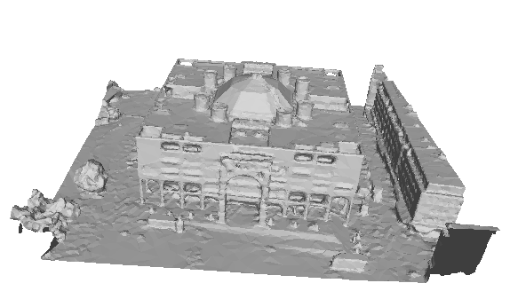
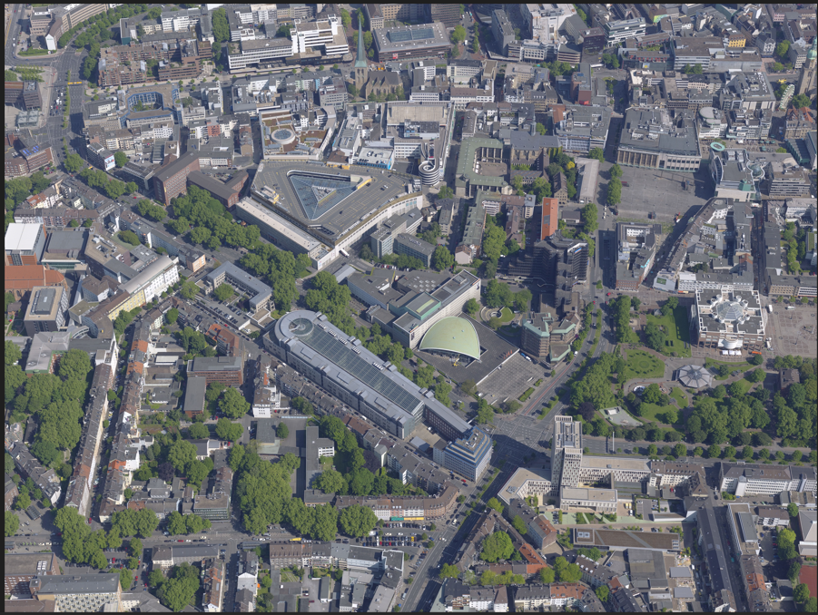
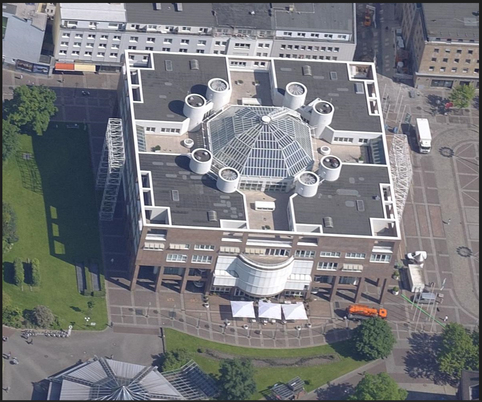

# roi_dataset_flow
## 目的
从覆盖大面积测区的航空倾斜数据中选取感兴趣区域（ROI），通过影像可见性筛选和影像裁剪，制作包含ROI的小型数据集。便于后续针对单体建筑建模。
* **可见性筛选**  
  计算ROI的世界点在影像上是否可见，也就是计算ROI的世界点是否在影像的视场角范围之内。具体而言就是比较相机朝向与相机中心和世界点连线之间的夹角和相机视场角的大小关系。如果有占比大于设定阈值的ROI世界点在某幅影像上可见，那这幅影像就是所需要的。
* **按照掩膜裁剪**  
  经过可见性筛选后的影像只是包含了ROI，如果想要整幅影像着重关注ROI，减少其他部分的干扰（比如ROI在原始影像中只占很小的一部分，后续重建如果采取降采样，存在的有效的信息就很少，影响重建效果），需要根据ROI世界点计算其在像片上对应的像点，生成掩膜来裁剪影像。具体而言就是由ROI世界点乘以相机的外参（w2c）、内参（c2p）得到像点，根据像点坐标的最值生成包围盒，按照包围盒生成裁剪影像（采取了一定的策略使得裁剪后的影像有相同尺寸）。
* **为新数据集生成类似nerf_studio和neuralangelo格式的相机参数文件（.json）**
  ```
   {
    "camera_mode": ,
    "camera_orientation": ,
    "aabb_scale": ,
    "aabb_range":,
    "sphere_center":,
    "sphere_radius":,
    "frames": [
    {
      "file_path": ,
      "intrinsic_matrix": ,
      "transform_matrix": ,
      "w": ,
      "h": 
    }, 
    ...
   }
  ```

## 准备
* 下载大型航空倾斜数据集  
  例：ISPRS发布的EuroSDR Benchmark for Multi-Platform Photogrammetry
  https://www2.isprs.org/commissions/comm2/icwg-2-1a/benchmark_main/
* 在context capture master中新建工程，加载该数据集，进行空三解算（如果数据集质量较好，可略过刺点）。
* 空三后导出相机参数文件（AT.xml）和去畸变的影像。
* 新建三维重建项目，框选感兴趣区域，生成该区域的mesh（Model.obj）文件以及元数据文件（metadata.xml）。
## 数据组织
* 新建`dataset`文件夹，按照下面的格式组织：
```
dataset
|_ dataset_01
   |_ images        // 对ROI可视的影像存放路径，一开始是空的
   |_ images_crop   // 依据ROI裁剪后的影像存放路径，一开始是空的
   |_ AT.xml
   |_ metadata.xml
   |_ Model.obj
```
## 代码结构
```
reader
|_ camera_reader.py // 读取相机参数（AT.xml）信息
|_ obj_reader.py    // 读取mesh文件（Model.obj）信息
scripts
|_ tools.py  // 一些工具函数
|_ scene_visualizer.py  // 将场景和位姿可视化
run.py  
```
## 参数设置
在`run.py`中，设置
* 数据集路径`dataset_dir`
* 是否是单相机`if_single_camera`
* 是否要裁剪影像`if_mask_crop`
* 是否将场景规范化到指定范围`if_standardization`
* 场景的目标半径`tar_radius`
* 其余的输入和输出文件路径不用改变  

设置好后运行`run.py`即可。

## 注意事项
* CC导出的是w2c的`3*3`旋转矩阵和相机在世界坐标系的`3*1`坐标, 在导出时选择`opencv`的相机坐标轴朝向`RDF`。

## 实验
* 数据集：  
Penta-Cam-Centre(8bit)  
* 兴趣区mesh:

* 经过可见性筛选出的一张影像(8176 * 6132)：

* 裁剪其中的兴趣区(1200 * 1000)：

* 将场景缩放到半径为1的球体内，获得新影像的参数：
```
"file_path": "images/001_009_145000282.jpg",
"intrinsic_matrix": [
[
    13658.7021484375,
    0.0,
    -2580.524169921875
],
[
    0.0,
    13658.7021484375,
    323.05224609375
],
[
    0.0,
    0.0,
    1.0
]
],
"transform_matrix": [
[
    0.9999997615814209,
    0.00018038207781501114,
    -0.0006661160150542855,
    -3.903818368911743
],
[
    0.0006009129574522376,
    -0.7022261023521423,
    0.7119537591934204,
    -11.74245548248291
],
[
    -0.0003393403603695333,
    -0.7119539976119995,
    -0.7022260427474976,
    11.748698234558105
],
[
    0.0,
    0.0,
    0.0,
    1.0
]
],
"w": 1200,
"h": 1000
```

## 参考
* 数据集信息：ISPRS
* 可视化部分：NeRF++
* json文件格式部分：NeRF_Studio Neuralangelo